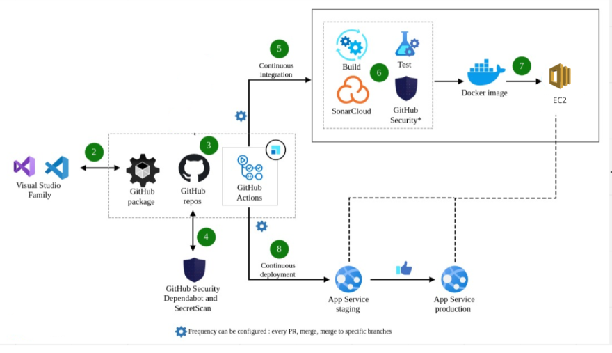
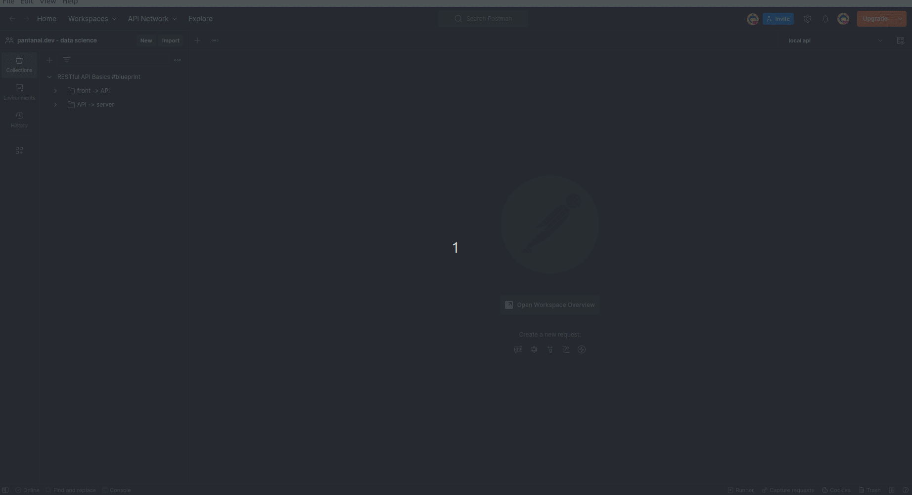
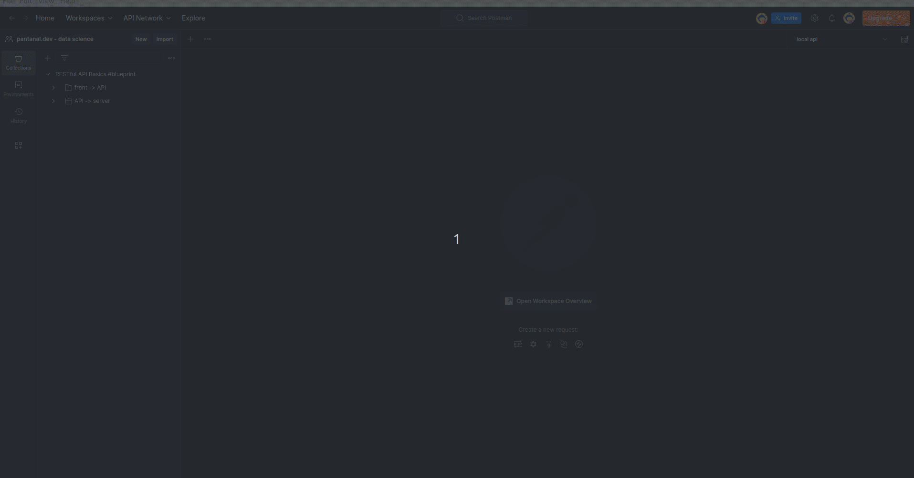
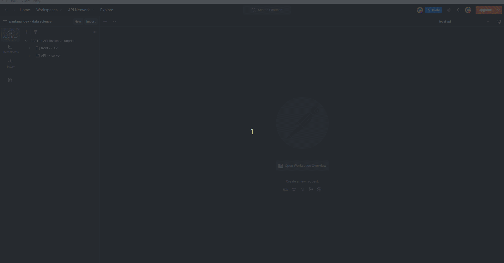

<div style="display: flex; align-items: center;">
  
  <h1>Data Wizard - Front-end</h1>
</div>

<p align="center">
  
  
  
  
  
  
  
  
   
</p>


### Tópicos 

:small_blue_diamond: [Descrição do projeto](#descrição-do-projeto)

:small_blue_diamond: [Funcionalidades](#funcionalidades)

:small_blue_diamond: [Deploy da Aplicação](#deploy-da-aplicação-dash)

:small_blue_diamond: [Pré-requisitos](#pré-requisitos)

:small_blue_diamond: [Como rodar a aplicação](#como-rodar-a-aplicação-arrow_forward)

## Descrição do projeto 

<p align="justify">
  O projeto visa detecção de fraudes e tem como objetivo identificar atividades ou padrões não usuais (incomuns). Como por exemplo, falsificação de assinaturas em cheques, clonagem de cartões de crédito, lavagem de dinheiro, declarar falência propositalmente (bankruptcy), etc.
</p>

<p align="justify">
  Esta aplicação API atua como um meio de transporte e validação dos dados relacionados às transações financeiras. Ela recebe os dados das transações e os valida para garantir que estejam corretos e completos. Em seguida, repassa esses dados para um sistema externo que é responsável por realizar a análise e detecção de fraudes. Dessa forma, a API desempenha um papel crucial na segurança e integridade do processo de detecção de fraudes, garantindo que apenas dados válidos sejam enviados para a análise.
</p>

## Funcionalidades

:heavy_check_mark: Receber os dados das transações financeiras.

:heavy_check_mark: Validar os dados das transações para garantir que estejam corretos e completos. 

:heavy_check_mark: Encaminhar os dados validados para um sistema externo responsável por realizar a análise e detecção de fraudes.  

:heavy_check_mark: Garantir a segurança e integridade do processo de detecção de fraudes, evitando o envio de dados inválidos para a análise. 

## Layout ou Deploy da Aplicação :dash:




## Pré-requisitos

:warning: [Docker](https://docs.docker.com/engine/install/ubuntu/)
:warning: [PHP v8.2](https://www.php.net/)

## Como rodar a aplicação :arrow_forward:

##### No terminal, clone o projeto: 

```
git clone git@github.com:enzodpaiva/Deteccao-Fraude-pantanal.dev-API.git
```
##### Criar .env na raiz do projeto a partir do .env.example
```bash 
cp .env.example .env
```

##### Executar aplicação através do Docker

```bash 
docker-compose up -d --build
```
##### Derrubar aplicação através do Docker

```bash 
docker-compose down
``` 

## Casos de Uso
- transaction-sample: recebe dados de fraudes (variaveis) do servidor e envia para a página.


- transaction-sample: envia os dados de fraude para o servidor e ele retorna o link da analise profunda da fraude através do streamlit.


- store-fraud: envia os dados de fraude para o servidor e ele retorna status true, indicando que a fraude enviada foi salva no banco de fraudes.


## Linguagens, dependencias e libs utilizadas :books:

- [PHP v8.2](https://www.php.net/)
- [Lumen v9.1.0](https://lumen.laravel.com/docs/10.x)
- [Docker](https://docs.docker.com/)
- [ES12](https://developer.mozilla.org/en-US/docs/Web/JavaScript)
- [Shell]()
- [Guzzle](https://packagist.org/packages/guzzlehttp/guzzle)
- [Curl](https://packagist.org/packages/curl/curl)
- [PHP Unit](https://phpunit.de/)
- [Request Validate v1.8](https://packagist.org/packages/pearl/lumen-request-validate)
- [MongoDB v3.9](https://www.mongodb.com/)

## Futuras melhorias que almejamos implementar

:memo: Possibilidade de pesquisar fraudes que ocorreram no passado.

:memo: Implementar autenticação e controle de acesso para garantir a segurança dos usuários. 

:memo: Adicionar suporte a diferentes tipos de fontes de dados para a detecção de fraudes, como feeds de redes sociais, dados de transações financeiras adicionais, etc.

:memo: Integrar a aplicação com serviços de notificação por e-mail ou mensagens para alertar os usuários sobre atividades suspeitas.

:memo: Implementar um sistema de feedback dos usuários para coletar sugestões e melhorar continuamente a aplicação.

:memo: Realizar testes rigorosos de desempenho para garantir que a aplicação possa lidar com grandes volumes de dados de forma eficiente.

:memo: Integrar a aplicação com sistemas de terceiros, como bancos de dados, para obter informações adicionais para análise de fraudes.

## Desenvolvedores

| [<br><sub>Enzo Paiva</sub>](https://github.com/enzodpaiva) |  [<br><sub>Alexandre Shimizu</sub>](https://github.com/AlexandreSh) |  [<br><sub>Eduardo Lopes</sub>](https://github.com/edu010101) | [<br><sub>Vitor Yuske</sub>](https://github.com/TuskNinja) |
| :---: | :---: | :---: | :---: |


## Licença 

The [MIT License]() (MIT)

Copyright :copyright: 2023 - Data Wizard - Front-end
