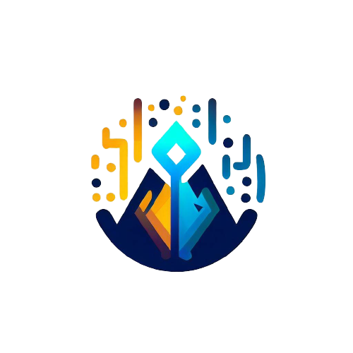

<div style="display: flex; align-items: center;">
  
  <h1>Data Wizard - API</h1>
</div>

<p align="center">
  
  
  
  
  
  
  
  
   
</p>


### Topics

:small_blue_diamond: [Project Description](#project-description)

:small_blue_diamond: [Features](#features)

:small_blue_diamond: [Application Deployment](#application-deployment-dash)

:small_blue_diamond: [Prerequisites](#prerequisites)

:small_blue_diamond: [How to Run the Application](#how-to-run-the-application-arrow_forward)


## Project Description

<p align="justify">
  The project aims at fraud detection and its objective is to identify unusual or uncommon activities or patterns. For example, check signature forgery, credit card cloning, money laundering, intentional bankruptcy declaration, etc.
</p>

<p align="justify">
  This API application acts as a means of transporting and validating data related to financial transactions. It receives transaction data and validates it to ensure that it is correct and complete. Then, it forwards this data to an external system responsible for performing fraud analysis and detection. Thus, the API plays a crucial role in the security and integrity of the fraud detection process, ensuring that only valid data is sent for analysis.
</p>

## Features

:heavy_check_mark: Receive financial transaction data.

:heavy_check_mark: Validate transaction data to ensure correctness and completeness.

:heavy_check_mark: Forward validated data to an external system responsible for performing fraud analysis and detection.

:heavy_check_mark: Ensure the security and integrity of the fraud detection process by preventing the sending of invalid data for analysis.

## Application Layout or Deployment :dash:


## Prerequisites

:warning: [Docker](https://docs.docker.com/engine/install/ubuntu/)
:warning: [PHP v8.2](https://www.php.net/)

## How to Run the Application :arrow_forward:

##### In the terminal, clone the project:

```
git clone git@github.com:enzodpaiva/Deteccao-Fraude-pantanal.dev-API.git
```
##### Create a .env file at the project root based on .env.example
```bash 
cp .env.example .env
```

##### Shut down the application using Docker

```bash 
docker-compose up -d --build
```
##### Derrubar aplicação através do Docker

```bash 
docker-compose down
``` 

## Use Cases

#### transaction-sample: Receives fraud data (variables) from the server and sends it to the page.


#### transaction-sample: Sends fraud data to the server, and it returns the link to the in-depth fraud analysis through Streamlit.


#### store-fraud: Sends fraud data to the server, and it returns a status of true, indicating that the sent fraud was saved in the fraud database.


## Linguagens, dependencias e libs utilizadas :books:

- [PHP v8.2](https://www.php.net/)
- [Lumen v9.1.0](https://lumen.laravel.com/docs/10.x)
- [Docker](https://docs.docker.com/)
- [ES12](https://developer.mozilla.org/en-US/docs/Web/JavaScript)
- [Shell]()
- [Guzzle](https://packagist.org/packages/guzzlehttp/guzzle)
- [Curl](https://packagist.org/packages/curl/curl)
- [PHP Unit](https://phpunit.de/)
- [Request Validate v1.8](https://packagist.org/packages/pearl/lumen-request-validate)
- [MongoDB v3.9](https://www.mongodb.com/)

## Future Improvements We Aim to Implement

:memo: Ability to search for past frauds.

:memo: Implement authentication and access control to ensure user security.

:memo: Add support for different data sources for fraud detection, such as social media feeds, additional financial transaction data, etc.

:memo: Integrate the application with email or messaging notification services to alert users about suspicious activities.

:memo: Implement a user feedback system to collect suggestions and continuously improve the application.

:memo: Conduct rigorous performance testing to ensure the application can efficiently handle large volumes of data.

:memo: Integrate the application with third-party systems, such as databases, to obtain additional information for fraud analysis.

## Makers

| [<br><sub>Enzo Paiva</sub>](https://github.com/enzodpaiva) |  [<br><sub>Alexandre Shimizu</sub>](https://github.com/AlexandreSh) |  [<br><sub>Eduardo Lopes</sub>](https://github.com/edu010101) | [<br><sub>Vitor Yuske</sub>](https://github.com/TuskNinja) |
| :---: | :---: | :---: | :---: |


## Licença 

The [MIT License]() (MIT)

Copyright :copyright: 2023 - Data Wizard - Front-end
